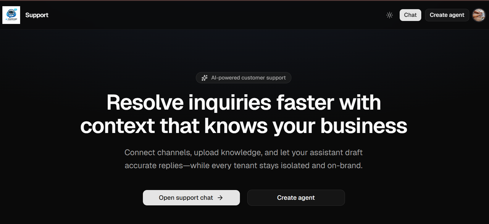
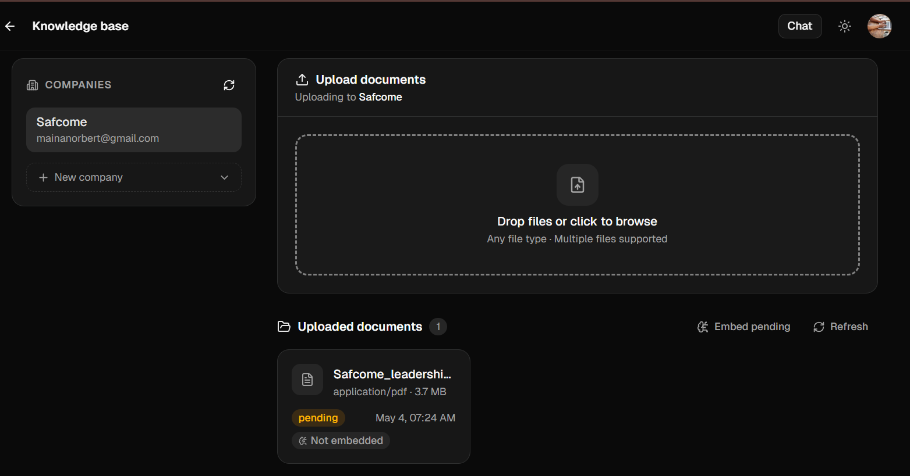
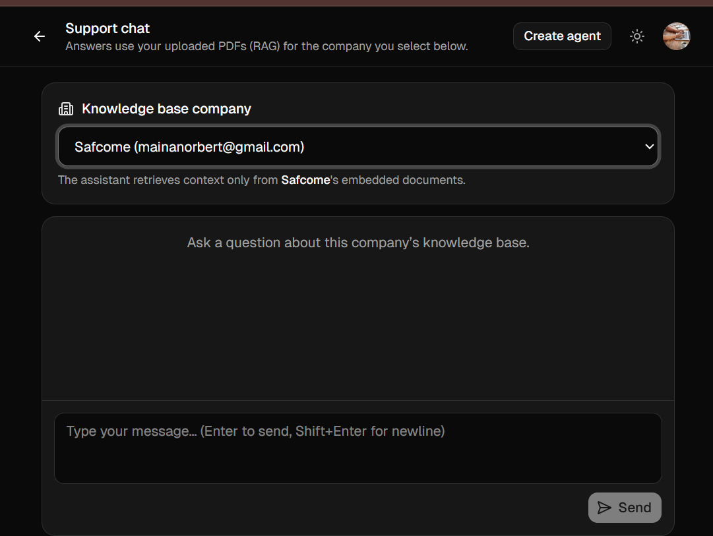

# Customer Support SaaS

Customer Support SaaS is an AI-powered support platform for multi-tenant businesses. It lets authenticated users create companies, upload PDF documents as a private knowledge base, embed that content into vector search, and chat with an assistant that answers using tenant-specific context.

The project is split into:

- a `frontend` Next.js application for authentication, document management, and chat
- a `backend` FastAPI API for ingestion, embeddings, retrieval, guardrails, and persistence

## Table of contents

- [What the project does](#what-the-project-does)
- [Screenshots](#screenshots)
- [Tech stack](#tech-stack)
- [Project structure](#project-structure)
- [How it works](#how-it-works)
- [Prerequisites](#prerequisites)
- [Environment variables](#environment-variables)
	- [Backend](#backend)
	- [Frontend](#frontend)
- [Run locally](#run-locally)
- [Run with Docker](#run-with-docker)
- [Tests](#tests)
- [Logging and error handling](#logging-and-error-handling)
- [Observability (traces, metrics, alerts, LLM usage)](#observability-traces-metrics-alerts-llm-usage)
- [Tests present](#tests-present)
- [Main API areas](#main-api-areas)
- [Development notes](#development-notes)

## What the project does

This application is designed to help support teams answer customer questions faster without mixing data across tenants.

Core capabilities include:

- Clerk-based authentication for the web app and API
- company management per signed-in user
- PDF upload and document ingestion
- background embedding of uploaded documents
- RAG-powered support chat scoped to a single company
- guardrails and monitoring endpoints for safety and observability
- user cost tracking for AI usage

## Screenshots

### Home page

Home interface with buttons for starting a chat and creating an agent.



### Agent creation and knowledge base

Create an agent knowledge base and upload documents for retrieval.



### Chat interface

Chat with an assistant using a specific knowledge base.



## Tech stack

- Frontend: Next.js 16, React 19, TypeScript, Tailwind CSS, Clerk
- Backend: FastAPI, SQLAlchemy, Alembic, pgvector, OpenRouter / OpenAI-compatible APIs
- Storage: Aiven PostgreSQL (pgvector) for application data, local filesystem or Supabase Storage for files
- Models (defaults): Text Embedding 3 Small for embeddings, GPT-4.1 Mini for chat (via OpenRouter/OpenAI-compatible APIs)
- Tooling: `npm` for the frontend, `uv` for the Python backend, Docker Compose for backend container runs

## Project structure

High-level layout of the repository (generated from the source tree; omitting generated folders such as `node_modules`, `.next`, `.venv`, and `__pycache__`).

```text
.
├── Makefile                      # Convenience targets for local workflows
├── docker-compose.yml            # Backend container image and ports
├── README.md
├── .cursor/
│   └── rules/                    # Cursor editor rules for this workspace
├── frontend/                     # Next.js 16 app (App Router)
│   ├── app/
│   │   ├── api/                  # Route handlers: BFF to FastAPI + Clerk bearer
│   │   │   ├── chat/
│   │   │   │   └── route.ts
│   │   │   ├── ingestion/
│   │   │   │   ├── companies/
│   │   │   │   │   ├── route.ts
│   │   │   │   │   └── [companyId]/
│   │   │   │   │       ├── documents/
│   │   │   │   │       │   ├── route.ts
│   │   │   │   │       │   ├── confirm/route.ts
│   │   │   │   │       │   └── uploads/route.ts
│   │   │   │   │       └── embed/route.ts
│   │   │   │   └── register/route.ts
│   │   │   ├── monitoring/
│   │   │   │   └── guardrail-events/route.ts
│   │   │   └── usage/route.ts
│   │   ├── chat/page.tsx
│   │   ├── dashboard/page.tsx
│   │   ├── documents/page.tsx
│   │   ├── globals.css
│   │   ├── layout.tsx
│   │   └── page.tsx
│   ├── components/
│   │   ├── ui/                   # Shared UI primitives (e.g. button)
│   │   ├── theme-provider.tsx
│   │   └── theme-toggle.tsx
│   ├── hooks/                    # Reserved for shared React hooks
│   ├── lib/
│   │   ├── server/               # Server-only helpers (Clerk → backend token)
│   │   │   └── resolve_clerk_bearer_for_backend.ts
│   │   ├── backend_base_url.ts
│   │   └── utils.ts
│   ├── public/                   # Static assets
│   ├── components.json           # shadcn/ui style config
│   ├── eslint.config.mjs
│   ├── middleware.ts             # Clerk middleware
│   ├── next.config.mjs
│   ├── package.json
│   ├── postcss.config.mjs
│   └── tsconfig.json
└── backend/                      # FastAPI API, SQLAlchemy, Alembic
    ├── alembic/                  # DB migrations
    │   ├── versions/             # Revision scripts (add under Alembic as needed)
    │   ├── env.py
    │   └── script.py.mako
    ├── alembic.ini
    ├── architecture/             # Mermaid sources + prose architecture notes
    ├── docs/                     # Product and system documentation
    │   ├── build-journey/
    │   │   └── README.md
    │   ├── architecture-overview.mmd
    │   ├── README.md
    │   ├── strategic-pitch.md
    │   └── system-architecture.md
    ├── scripts/                  # Shell entrypoints for dev, test, migrate
    │   ├── dev.sh
    │   ├── migrate.sh
    │   ├── make_migration.sh
    │   └── test.sh
    ├── src/
    │   ├── api/v1/               # Versioned HTTP surface
    │   │   ├── routers/
    │   │   │   ├── agents.py     # RAG chat
    │   │   │   ├── companies.py # Companies + documents + uploads
    │   │   │   ├── conversations.py
    │   │   │   ├── monitoring.py # Guardrail audit listing
    │   │   │   ├── tenants.py
    │   │   │   ├── users.py      # User sync + usage reporting
    │   │   │   └── webhooks.py
    │   │   └── schemas/          # Pydantic request/response models
    │   │       ├── agent.py
    │   │       ├── ingestion.py
    │   │       ├── message.py
    │   │       ├── monitoring.py
    │   │       ├── response.py
    │   │       ├── tenants.py
    │   │       └── usage.py
    │   ├── core/                 # App wiring: config, DB, auth, logging
    │   │   ├── cache.py
    │   │   ├── clerk_auth.py
    │   │   ├── config.py
    │   │   ├── database.py
    │   │   ├── dependencies.py
    │   │   ├── embedding_vector.py
    │   │   ├── logging.py
    │   │   ├── pgvector_setup.py
    │   │   └── security.py
    │   ├── domain/               # Placeholder for domain modules
    │   ├── models/               # SQLAlchemy ORM models
    │   │   └── __init__.py
    │   ├── services/             # Ingestion, RAG, embeddings, storage, guardrails
    │   │   ├── chunking.py
    │   │   ├── cost_monitoring.py
    │   │   ├── document_text.py
    │   │   ├── embedding_pipeline.py
    │   │   ├── embeddings.py
    │   │   ├── guardrails.py
    │   │   ├── ingestion.py
    │   │   ├── openrouter_agent.py
    │   │   ├── rag_agent.py
    │   │   ├── rag_retrieval.py
    │   │   └── supabase_storage.py
    │   ├── tests/                # Placeholder / in-package tests if used
    │   ├── workers/              # Placeholder for background workers
    │   └── main.py               # FastAPI application factory
    ├── tests/                    # Pytest suites
    │   ├── cost_tests/
    │   │   └── test_cost_monitoring.py
    │   ├── embeddings_tests/
    │   │   └── query_embeddings.py
    │   ├── ingestion_tests/
    │   │   └── test_document_ingestion.py
    │   └── storage_tests/
    │       └── test_storage_backends.py
    ├── .env.example
    ├── pyproject.toml
    └── uv.lock
```

**Frontend:** `app/` holds pages and `app/api/` proxies authenticated calls to the Python API. **Backend:** `src/main.py` mounts routers; business logic lives under `src/services/`; persistence under `src/models/`; migrations under `alembic/`. **Docs:** `backend/docs/` is Markdown product and system docs; `backend/architecture/` holds Mermaid (`.mmd`) diagrams and related narrative files.

## How it works

1. A user signs in through Clerk in the frontend.
2. The user creates a company workspace.
3. The user uploads PDF files for that company.
4. The backend stores the files and triggers background embedding (FastAPI background tasks).
5. When the user opens chat, the assistant retrieves the most relevant chunks for the selected company and generates a grounded response.

## Prerequisites

Install the following before running locally:

- Node.js 20 or newer
- npm
- Python 3.12
- `uv` for Python dependency management
- PostgreSQL with `pgvector` support
- Clerk credentials
- An OpenRouter API key

Optional:

- Docker and Docker Compose
- Supabase Storage credentials if you do not want to store uploaded files locally

## Environment variables

### Backend

Create `backend/.env` and set the values required by `backend/src/core/config.py`.

Required:

- `OPENROUTER_API_KEY`
- `CLERK_SECRET_KEY`
- `DATABASE_URL` or `EIVEN_SERVICE_URL`

Recommended for local development:

- `CLERK_AUTHORIZED_PARTIES=http://localhost:3000,http://127.0.0.1:3000`
- `CORS_ALLOWED_ORIGINS=http://localhost:3000,http://127.0.0.1:3000`

Optional:

- `OPENROUTER_BASE_URL` (defaults to `https://openrouter.ai/api/v1`)
- `OPENROUTER_MODEL`
- `EMBEDDING_MODEL`
- `EMBEDDING_DIMENSIONS`
- `UPLOAD_ROOT`
- `SUPABASE_URL`
- `SUPABASE_SERVICE_KEY`
- `SUPABASE_BUCKET`
- `CORS_ALLOW_CREDENTIALS`

Notes:

- If `DATABASE_URL` uses the `postgres://` prefix, the backend normalizes it automatically.
- Local file storage is used when Supabase variables are not configured.
- The API exposes a health endpoint at `http://127.0.0.1:8000/health`.

### Frontend

Create `frontend/.env.local`.

Required:

- `NEXT_PUBLIC_CLERK_PUBLISHABLE_KEY`
- `CLERK_SECRET_KEY`

Optional:

- `BACKEND_API_BASE_URL=http://127.0.0.1:8000`

Notes:

- The frontend talks to the FastAPI service through Next.js route handlers.
- If `BACKEND_API_BASE_URL` is not set, it defaults to `http://127.0.0.1:8000`.

## Run locally

### 1. Start the backend

```bash
cd backend
uv sync --extra dev
./scripts/migrate.sh
./scripts/dev.sh
```

The backend will start on `http://127.0.0.1:8000`.

### 2. Start the frontend

Open a second terminal:

```bash
cd frontend
npm install
npm run dev
```

The frontend will start on `http://127.0.0.1:3000`.

### 3. Use the app

1. Open `http://localhost:3000`
2. Sign in with Clerk
3. Create a company in the Documents page
4. Upload PDF files
5. Wait for embedding to finish
6. Open the Chat page and ask company-specific questions

## Run with Docker

The provided `docker-compose.yml` starts the backend service.

From the project root:

```bash
docker compose up --build
```

This publishes the backend on port `8000`.

Before running Docker Compose, make sure the required backend environment variables are available in your shell or in an env file that Docker Compose can read, especially:

- `OPENROUTER_API_KEY`
- `CLERK_SECRET_KEY`
- `CLERK_AUTHORIZED_PARTIES`

You can still run the frontend locally with:

```bash
cd frontend
npm install
npm run dev
```

and point it at the backend container by setting:

```bash
BACKEND_API_BASE_URL=http://127.0.0.1:8000
```

## Tests

Run backend tests with:

```bash
cd backend
uv sync --extra dev
./scripts/test.sh
```

Frontend quality checks:

```bash
cd frontend
npm install
npm run lint
npm run typecheck
```

## Logging and error handling

Backend logging uses the standard Python `logging` module in service layers (for example, embedding, guardrails, and RAG flows). A centralized logging setup is wired at app startup (`backend/src/core/logging.py`) with a rotating file handler and console output.

Error handling relies on FastAPI defaults plus explicit `HTTPException` raises for validation/authentication errors in services and routers. Background workflows (such as embedding) catch exceptions, roll back database work, and emit error logs, but do not surface custom error responses beyond FastAPI defaults.

## Observability (traces, metrics, alerts, LLM usage)

- Tracing: not configured.
- Metrics: not configured.
- Alerts: not configured.
- Health check: `GET /health` returns a simple liveness payload.
- LLM-specific monitoring: OpenRouter/OpenAI usage is normalized into prompt/completion/total token counts and cost, then stored per user in the database for reporting. There is no external metrics/telemetry export configured.

## Tests present

Backend tests live under `backend/tests` and are grouped as:

Unit tests:

- Cost monitoring (`tests/cost_tests/test_cost_monitoring.py`) covering token/cost aggregation.
- Storage backends (`tests/storage_tests/test_storage_backends.py`) covering local vs Supabase upload paths and extraction.

Integration tests:

- Document ingestion API (`tests/ingestion_tests/test_document_ingestion.py`) using FastAPI `TestClient` and a temp SQLite DB.

There are no frontend unit/integration tests in this repo; frontend checks are lint and typecheck only.

## Main API areas

The FastAPI app mounts routes under `/api/v1`:

- `/api/v1/users` for user registration and cost reporting
- `/api/v1/companies` for company creation, document listing, uploads, and embedding triggers
- `/api/v1/agents` for RAG chat
- `/api/v1/monitoring` for guardrail event inspection

## Development notes

- Uploaded documents are validated as PDFs by the backend.
- Document embedding runs in FastAPI background tasks after uploads complete.
- PostgreSQL tables are created on app startup, and `pgvector` is ensured automatically when the database is PostgreSQL.
- Tenant isolation is central to the design: company data, document retrieval, and chat responses are scoped to the authenticated owner and selected company.
